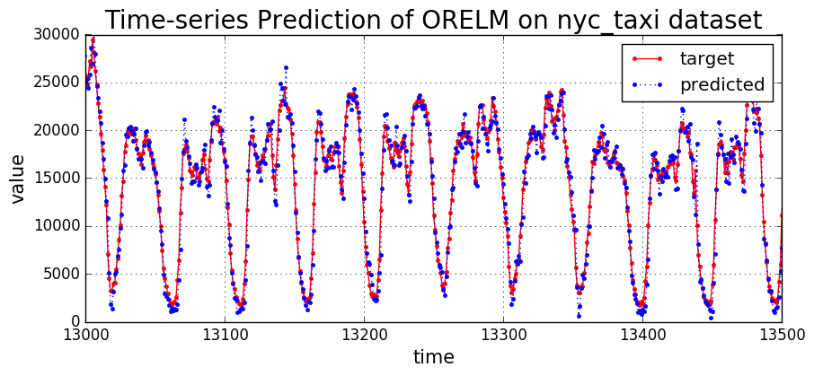

# Online-Recurrent-Extreme-Learning-Machine
Online-Recurrent-Extreme-Learning-Machine (OR-ELM) for time-series prediction, implemented in python.

## Requirements
* Python 2.7
* Numpy
* Matplotlib
* pandas

## Dataset
* NYC taxi passenger count
 * Prediction of the New York City taxi passenger data. left.
Example portion of taxi passenger data (aggregated at 30 min
intervals).
  * public data stream provided by the [New
York City Transportation Authority](http://www.nyc.gov/html/tlc/html/about/trip_record_data.shtml )
  * preprocessed (aggregated at 30 min intervals) by Cui, Yuwei, et al. in ["A comparative study of HTM and other neural network models for online sequence learning with streaming data." Neural Networks (IJCNN), 2016 International Joint Conference on. IEEE, 2016.](http://ieeexplore.ieee.org/abstract/document/7727380/)
  , [code](https://github.com/numenta/htmresearch/tree/master/projects/sequence_prediction)

## Implemented Algorithms
* Online Sequential Extreme Learning Machine __(OS-ELM)__
  * Liang, Nan-Ying, et al. "A fast and accurate online sequential learning algorithm for feedforward networks." IEEE Transactions on neural networks 17.6 (2006): 1411-1423.
* Fully Online Sequential Extreme Learning Machine __(FOS-ELM)__
  * Wong, Pak Kin, et al. "Adaptive control using fully online sequential-extreme learning machine and a case study on engine air-fuel ratio regulation." Mathematical Problems in Engineering 2014 (2014).
* Normalized FOS-ELM __(NFOS-ELM)__ (proposed)
  * FOS-ELM + Layer Normalization + forgetting factor
* Normalized Auto-encoded FOS-ELM __(NAOS-ELM)__ (proposed)
  * FOS-ELM + Layer Normalization + forgetting factor + weight auto-encoding (input->hidden)
* Online Recurrent Extreme Learning Machine __(OR-ELM)__ (proposed)
  * FOS-ELM + Layer Normalization + forgetting factor + weight auto-encoding (input->hidden, hidden->hidden)
  * This is for training recurrent neural networks (RNNs)

## Example of usage
\'python run.py -a ORELM\'

## Result

---------------------------------
If you use this code, please cite our paper "Online Recurrent Extreme Learning Machine and its Application to time-series Prediction" in IEEE Access.

Paper URL: http://ieeexplore.ieee.org/abstract/document/7966094/

Park, Jin-Man, and Jong-Hwan Kim. "Online recurrent extreme learning machine and its application to time-series prediction." Neural Networks (IJCNN), 2017 International Joint Conference on. IEEE, 2017.